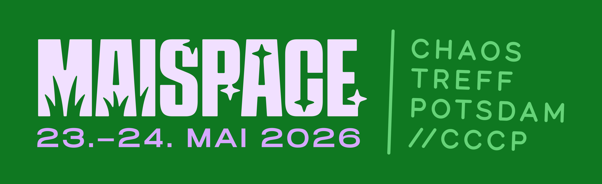

# Veranstaltungen

# MaiSpace 2026

23.05.2026 - 24.05.2026

-> Zur Veranstaltungsseite [MaiSpace 2026](maispace)

## Vergangene Veranstaltungen

### Geekend 2023

Im Herbst 2023 haben wir ein [ChaosZone](https://chaoszone.cz/)-Geekend ausgerichtet und uns zwei Tage lang mit kreativer Nutzung von **E-Paper-Displays**, bekannt aus manchen Elektronik- oder Supermärkten, beschäftigt.

Mehr Informationen zum Geekend findet ihr auf der [archivierten Einladung zum Geekend 2023](geekend).

---

### RTC22 - Reconnect To Chaos

Vom 27. bis 30.12.2022 fand bei uns unter dem Namen "Reconnect to Chaos" unsere erste größere Veranstaltung mit Publikum statt.
Wir waren damit Teil der dezentralen Jahresendveranstaltungen 2022, kurz JEV22.

 Alle Informationen zum Event findet ihr unter 
<a class="button button-75 center" role="button" href="https://ccc-p.org/rtc22/">RTC 2022</a>.

---

### rC3 2021 NOWHERE

Zum Jahresende 2021 haben wir zusammen mit dem [EBK Halle](https://eigenbaukombinat.de/) eine [ChaosZone](https://chaoszone.cz/)-Bühne
gebaut und als Teil von [rC3 2021 NOWHERE](https://events.ccc.de/2021/11/08/rc3-2021-nowhere/) Vorträge gestreamt.

Die Aufzeichnungen sind hier zu finden: [https://media.ccc.de/c/rc3-2021/ChaosZone](https://media.ccc.de/c/rc3-2021/ChaosZone)